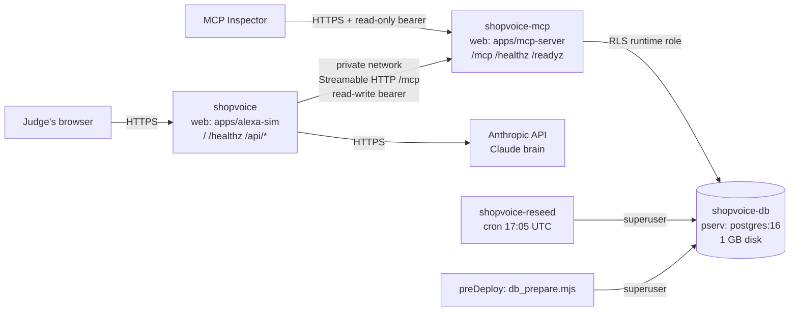

# Design Document: hosted demo on Render

## Overview

Three always-on Render services plus one cron job. Everything is built from the repo's existing Dockerfiles.



- Postgres runs as a **private service**, not Render's managed Postgres. Migration 004 runs `ALTER ROLE … BYPASSRLS` for the definer-function owner, which needs a superuser, and managed Postgres does not grant one.
- The web services log in as a plain role under RLS.
- The simulator and the MCP server are separate services, as in production: the simulator is an MCP client calling the server over the network.

## Components and interfaces

### 1. Token scopes (Requirement 1)

**Migration `db/v2/migrations/019_v2_mcp_token_scopes.sql`**

`migrate:up`:

```sql
ALTER TABLE mcp_access_tokens
  ADD COLUMN IF NOT EXISTS scopes TEXT NOT NULL DEFAULT 'shop.read shop.write'
  CHECK (scopes IN ('shop.read', 'shop.read shop.write'));
DROP FUNCTION IF EXISTS resolve_mcp_access_token(TEXT);
CREATE FUNCTION resolve_mcp_access_token(p_token_hash TEXT)
RETURNS TABLE (tenant_id UUID, token_id UUID, scopes TEXT) …   -- same body as 017, plus t.scopes
ALTER FUNCTION … OWNER TO groceryclaw_bootstrap_owner;
REVOKE ALL … FROM PUBLIC;
GRANT EXECUTE … TO groceryclaw_app_user;
```

`migrate:down`: recreate the 017 function (two columns), then drop the column.

Wrap the up and down sections each in `BEGIN; … COMMIT;`, like 017.

**Store** (`apps/mcp-server/src/store.ts`):
- `resolveTokenHash(hash)` returns `{ tenantId, scopes: readonly string[] } | null`.
- `pg-store.ts` splits the `scopes` text on spaces.
- `memory-store.ts` takes an optional read-only token set in `buildDemoDataset({ tokens, readOnlyTokens })`.
- `server.ts` passes `MCP_JUDGE_TOKEN` when the memory backend is used.

**HTTP** (`apps/mcp-server/src/http.ts`): the static principal's `scopes` come from the resolved token instead of the constant `STATIC_SCOPES`. The token cache stores `{ tenantId, scopes }`. The existing `callsWriteTool` gate and `insufficientScope` response stay unchanged.

**Token script**:
- `scripts/v2/mcp_token_lib.mjs` `mintMcpToken({ tenantId, label, token, readOnly })` inserts `scopes`.
- `ON CONFLICT (token_hash) DO UPDATE SET scopes = EXCLUDED.scopes, status = 'active'`, so re-registering is idempotent and can change scope.
- `scripts/v2/create_mcp_token.mjs` accepts `--read-only`.

### 2. `scripts/deploy/db_prepare.mjs` (Requirement 2)

Environment:

| Variable | Meaning |
|---|---|
| `PGHOST`, `PGPORT` (5432), `POSTGRES_DB`, `POSTGRES_USER` (postgres), `POSTGRES_PASSWORD` | Superuser connection; used only here and by the reseed |
| `MCP_DB_USER`, `MCP_DB_PASSWORD` | Runtime login role for the MCP server |
| `SIM_MCP_TOKEN` | Read-write demo token used by the simulator |
| `MCP_JUDGE_TOKEN` | Read-only demo token for judges |
| `DEMO_SHOP_TIMEZONE` | Default `Asia/Ho_Chi_Minh` |

Steps:
1. Wait for the database, retrying up to 60 s. On first boot the private service may still be starting.
2. Spawn `node scripts/v2/remote_migrate.mjs` with `DATABASE_URL` set to the superuser URL; it applies the pending migrations.
3. In one transaction, ensure the runtime role. Use a `DO` block with `format()` so the role name and password are never interpolated in JS:

   ```sql
   DO $$ BEGIN
     IF NOT EXISTS (SELECT 1 FROM pg_roles WHERE rolname = current_setting('deploy.role')) THEN
       EXECUTE format('CREATE ROLE %I LOGIN', current_setting('deploy.role'));
     END IF;
     EXECUTE format('ALTER ROLE %I WITH LOGIN PASSWORD %L NOSUPERUSER NOBYPASSRLS NOCREATEROLE NOCREATEDB',
                    current_setting('deploy.role'), current_setting('deploy.password'));
     EXECUTE format('GRANT groceryclaw_app_user TO %I', current_setting('deploy.role'));
   END $$;
   ```

   Pass the values with `SELECT set_config('deploy.role', $1, true), set_config('deploy.password', $2, true)` before the `DO` block, in the same transaction.
4. If `SELECT 1 FROM shop_profiles WHERE tenant_id = DEMO_TENANT_ID` finds no row (checked as superuser), apply the demo seed (step 5 of the reseed design).
5. Register the tokens with the shared helper `registerDemoTokens(client)` from `scripts/deploy/demo_tokens.mjs`, which is used by both deploy scripts.
6. Print only step names and counts.

**MCP server start-up guard** (`apps/mcp-server/src/server.ts`, postgres backend only): run `SELECT rolsuper, rolbypassrls FROM pg_roles WHERE rolname = current_user`. If either is true, throw `Refusing to start: the MCP database user must not be a superuser or have BYPASSRLS`. Local development as `postgres` sets `MCP_ALLOW_PRIVILEGED_DB_USER=true` to skip the check. Default is false; `.env.example` documents it for local use only.

**Config** (`apps/mcp-server/src/config.ts`): `databaseUrl` falls back to `postgresql://${encodeURIComponent(user)}:${encodeURIComponent(password)}@${host}:${port}/${encodeURIComponent(name)}` when `MCP_DB_URL`, `DB_APP_URL` and `DATABASE_URL` are all unset.

### 3. `scripts/deploy/reseed_demo.mjs` (Requirement 3)

1. Superuser connection, same variables as `db_prepare`.
2. Compute today in `DEMO_SHOP_TIMEZONE` with `Intl.DateTimeFormat('en-CA', { timeZone })`.
3. Read `db/v2/seed/002_demo_shop_seed.sql`.
4. On one client, run `SELECT set_config('demo.anchor_date', $1, false)`, then the seed file as one simple query. The file has its own `BEGIN`/`COMMIT`, and deletes and re-inserts only the demo tenant's rows.
5. `registerDemoTokens(client)`.
6. Exit 0 and print `reseeded demo tenant for <date>`.

Export the core as `reseedDemo(client, { today })` so the DB test can call it directly. The CLI wrapper only connects and calls it.

### 4. Simulator health (Requirement 4)

`apps/alexa-sim/src/server.ts`:
- A small `mcpHealth()` helper calls `toolbox.listTools()` under `Promise.race` with a 2 s timeout.
- It caches `{ status, protocolVersion, tools, checkedAtMs }` for 15 s.
- `/healthz` always returns 200 with the body from Requirement 4.1.
- `/readyz` keeps returning 503 when the check fails.
- The `/healthz` route stays before the origin-verify gate, as today.

### 5. Landing panel (Requirement 5)

`apps/alexa-sim/static/index.html`, `app.js`, `styles.css`:
- A `<section id="try-panel" aria-labelledby="try-title">` with an `<h2>` "Try these 5 phrases" and an `<ol>` of five `<button type="button" class="try-phrase" data-phrase="…">`.
- `app.js` attaches one click listener that calls the existing send-typed-turn function with `data-phrase`.
- Below the list goes one sentence: "This is a simulated Alexa+ experience: the page's server is an MCP client that calls the ShopVoice MCP server over Streamable HTTP (protocol <version>)." The version is filled from `/api/config`.
- No inline scripts or styles.
- A unit test reads `static/index.html` and checks that every `DEMO_UTTERANCES[i].text` appears in order.

### 6. Render Blueprint and proxy hops (Requirement 6)

`render.yaml` (shape; adjust plan names to Render's current ones):

```yaml
envVarGroups:
  - name: shopvoice-db-admin      # superuser: only the db service, pre-deploy and cron use it
    envVars:
      - key: POSTGRES_PASSWORD
        generateValue: true
  - name: shopvoice-tokens        # pasted once by the owner (format: sv_ + 43 base64url chars)
    envVars:
      - key: SIM_MCP_TOKEN
        sync: false
      - key: MCP_JUDGE_TOKEN
        sync: false
services:
  - type: pserv
    name: shopvoice-db
    runtime: image
    image: { url: docker.io/library/postgres:16-bookworm }
    disk: { name: pgdata, mountPath: /var/lib/postgresql/data, sizeGB: 1 }
    envVars: [POSTGRES_DB=shopvoice, PGDATA=/var/lib/postgresql/data/pgdata, fromGroup shopvoice-db-admin]
  - type: web
    name: shopvoice-mcp
    runtime: docker
    dockerfilePath: ./apps/mcp-server/Dockerfile
    preDeployCommand: node scripts/deploy/db_prepare.mjs
    healthCheckPath: /healthz
    envVars: MCP_PORT=10000, MCP_DATA_BACKEND=postgres, MCP_DB_HOST (fromService pserv host),
             MCP_DB_NAME=shopvoice, MCP_DB_USER=shopvoice_app, MCP_DB_PASSWORD (generateValue),
             PGHOST (fromService), POSTGRES_DB, groups shopvoice-db-admin + shopvoice-tokens,
             MCP_TRUST_PROXY=2, NODE_ENV=production
  - type: web
    name: shopvoice
    runtime: docker
    dockerfilePath: ./apps/alexa-sim/Dockerfile
    healthCheckPath: /healthz
    envVars: SIM_PORT=10000, SIM_MCP_HOSTPORT (fromService web shopvoice-mcp hostport),
             group shopvoice-tokens, SIM_TRUST_PROXY=2, ANTHROPIC_API_KEY (sync: false),
             SIM_BRAIN=claude, CLAUDE_DAILY_TURN_CAP=400
  - type: cron
    name: shopvoice-reseed
    runtime: docker
    dockerfilePath: ./apps/mcp-server/Dockerfile
    schedule: "5 17 * * *"
    dockerCommand: node scripts/deploy/reseed_demo.mjs
    envVars: PGHOST, POSTGRES_DB, group shopvoice-db-admin + shopvoice-tokens
```

Notes:
- `MCP_DB_PASSWORD` lives only on `shopvoice-mcp`. Its pre-deploy step runs in the same service and sees it.
- Already in the simulator, so this feature only sets them in `render.yaml`:
  - `SIM_MCP_HOSTPORT` (the simulator builds `http://${SIM_MCP_HOSTPORT}/mcp` when `SIM_MCP_URL` is unset);
  - `SIM_TRUST_PROXY` (hop count);
  - `SIM_BRAIN`, `ANTHROPIC_API_KEY`, `CLAUDE_DAILY_TURN_CAP`.
- The MCP server Dockerfile must copy `scripts/deploy/`, `scripts/v2/remote_migrate.mjs`, `scripts/v2/gen_demo_seed.mjs` and `db/v2/` into the image, so the pre-deploy and cron commands can run.

**Proxy hops** (`apps/mcp-server/src/client-ip.ts`, `config.ts`):
- `trustProxy` becomes a number of hops. `false`/`0` means use the socket address; `true`/`1` means the rightmost entry; N means the Nth entry from the right.
- If the header has fewer than N entries, use the leftmost one present. Never fall back to an attacker-chosen earlier entry when enough entries exist.
- Render's proxy appends the viewer's address and then its own, so Render needs 2.

**Docs**: `docs/hackathon/DEPLOY_RENDER.md`, `.env.example`, `docs/ENV_VARS.md`.

## Data models

`mcp_access_tokens.scopes TEXT NOT NULL DEFAULT 'shop.read shop.write'`, constrained to `'shop.read'` or `'shop.read shop.write'`. Nothing else changes in the schema.

## Error handling

- `db_prepare` and the reseed exit non-zero with a one-line message on failure. Render then keeps the previous deploy running.
- The MCP server refuses to start as a privileged DB user (2.7).
- `/healthz` never throws. An MCP failure is reported in the body.

## Testing strategy

| Test file | Covers |
|---|---|
| `tests/v2/mcp-http.test.mjs` (memory backend) | Read-only token: read tool OK, `create_reorder_draft` and `confirm_reorder` refused with insufficient scope. Read-write token unchanged. Proxy hop count 0/1/2 and short headers |
| `tests/v2/db/mcp-token-scopes.test.mjs` | Migration 019: `resolve_mcp_access_token` returns scopes; re-registering flips scope idempotently |
| `tests/v2/db/deploy-prepare.test.mjs` | `db_prepare` twice is idempotent. The runtime role has `rolsuper = false` and `rolbypassrls = false`, and sees 0 demo rows without tenant context. Tokens resolve with the right scopes. Reseed keeps tokens and leaves another tenant untouched |
| `tests/v2/alexa-sim.test.mjs` | `/healthz` with a healthy and a failing fake toolbox (200 in both, `mcp.status`). `/readyz` 503 on failure. No secret in the body. The landing panel lists the five phrases |
| `tests/v2/render-blueprint.test.mjs` | Text checks on `render.yaml`: every secret key uses `generateValue: true` or `sync: false`; both web services have `healthCheckPath: /healthz`; the cron schedule is `5 17 * * *` |

The DB tests skip when `DATABASE_URL` is unset, like the existing `tests/v2/db/*` files.
